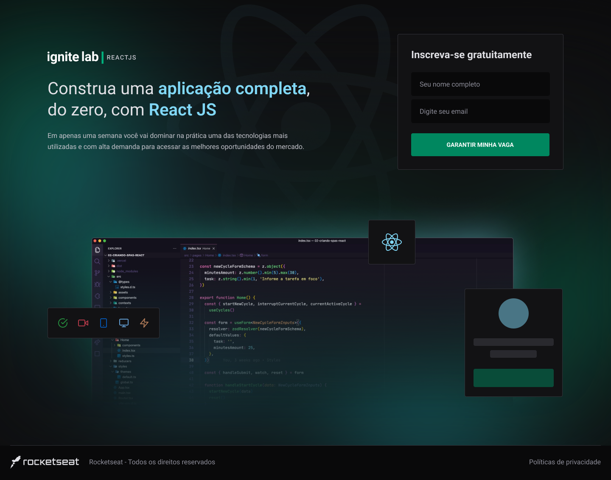
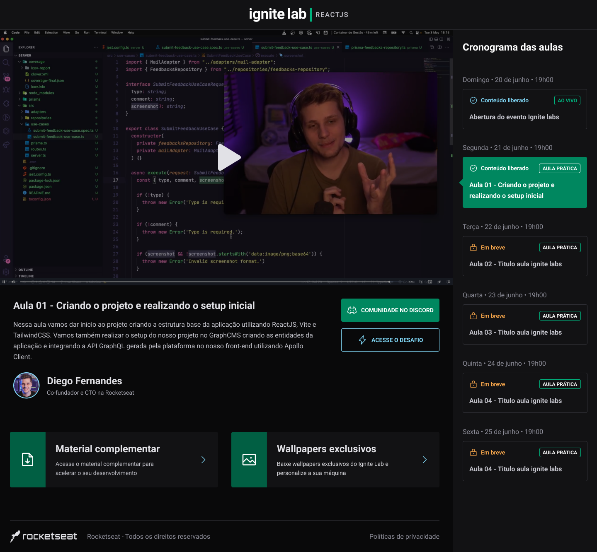

<div style="display:flex;flex-direction: column; align-items:center;">
      
    <hr style="width:100%", size="1", color=black>  
</div>


## 💡 Sobre o Projeto

A 'Event-Plataform' é uma aplicação cujo objetivo é centralizar, de uma forma organizada, insformações como pofessores e seus cursos, disponibilizamos essas aulas em um player dentro da nossa plataforma. As informações sobre cursos, professores e pessoas inscritas são fornecidas de forma dinâmica através da plataforma [GraphCMS](https://app.graphcms.com/). Esse projeto foi criado no evento Ignit Lab, da [Rocketseat](https://app.rocketseat.com.br/).

<div align="center" style="display:flex;flex-direction:column;align-items:center">
  <div style="display: flex;justify-content: space-between;">
    
    
  </div>
</div>

## 👩🏽‍💻 Executando o projeto localmente na sua maquina
Para rodar essa aplicação localmente você precisará adicionar o arquivo '.env' e informar as duas variaveis de ambiente contidas no arquivo '.env.example'. Após fazer essa configuração, siga os passos abaixo.

```# Clone o repositório
git clone https://github.com/dev-mauricioAB/event-plataform

# Acesse a pasta do projeto
cd event-platform

# Instale as dependências
npm install

# Execute a aplicação
npm run dev

# O servidor inciará na porta:3000 - acesse http://localhost:3000

```

## 🔦 Tecnologias Utilizadas

<table style="display:flex">
  <tbody>
    <tr>
      <td align="center" height="110" width="140">
        
        <br>
        <span>HTML</span>
      </td>
      <td align="center" height="110" width="140">
        
        <br>
        <span>CSS</span>
      </td>
      <td align="center" height="110" width="140">
        
        <br>
        <span>JavaScript</span>
      </td>
    </tr>
    <tr>
     <td align="center" height="110" width="140">
        
        <br>
        <span>React</span>
      </td>
      <td align="center" height="110" width="140">
        
        <br>
        <span>TypeScript</span>
      </td>
      <td align="center" height="110" width="140">
        
        <br>
        <span>GraphQL</span>
      </td>
    </tr>
    <tr>
  </tbody>
</table>

<table style="display:flex">
<tbody>
    <tr>
      <td align="center" height="110" width="140" style="display:flex;flex-direction:column;justify-content:center">
        <img alt="GraphCMS logo" src="data:image/png;base64,iVBORw0KGgoAAAANSUhEUgAAAdcAAABrCAMAAAASJThJAAAAflBMVEX///8AAADt7e0lJSXc3Nz6+vrq6upcXFycnJxNTU0vLy87Ozvf39/AwMC8vLyKioqqqqpFRUXT09Pz8/PIyMi0tLRGRkaDg4OkpKQeHh7r6+vX19fHx8d3d3cZGRm1tbV9fX2UlJQODg5jY2NtbW02NjZhYWFWVlYLCwsxMTHOcUaHAAAPZUlEQVR4nO2d6WKyOhCGBQU3UEQUrSvuvf8bPCwJTJIZJIhfTy3vr1YgJHmyTiah09HWbqL/TKv/v/rGsPfTcWjVvPqGYYTzn45Fq6aVcDWM1U9Ho1XDyrgaY/enI9KqUTGuhnGzfzoqrRpUztUwpm03+zkCXI3RT0emVWOCXLs/HZlWjanl+plquX6mPp/rV1ho89OR+Wf6fK49kMLDT0fmn+nWcv1EBfuW6+fJuRhGy/XTZEWG0XL9NFmLvdFy/ThtljLVluvvl3lUqbZcf7uUjrXl+gGyDmMca8v1N2vTJ6i2XH+x7B1JteX6a2USHWvL9VdrcS3F2nL9lQqG5VRbrr9RDj1c+kNc4aYVy7R+LE5NyYxOOMrRqC7XuW0Hh+nCdb40s8d0FgNkfdu0HXc1mGxtUy84y7S3XhR5AfUgwvXLnZ7vy/Hs3g+DCk6Y8SvcycpL4vY8raa9WUwXEwe5dW4Hk9V05dJJtMzexJsOJiW3QC1GMk+m4/xcj+tmWkyC7xGLhO3kYtEcTHMxlN5lHT+ykMNzj10e3PqyYlniyOGpv8yjfl5iu/geMoWrL8wJvgdPkuqH9/wV+77qcuFHg8EgYvHZHHOr+30gFpltmA9v1rst9qb54F6wyHOBVEDZIW5OTX+JlRzSOU0WeM9Xep81k7J0wP4RuZqhHF6YhOcU/58yp3WzW/yU3NG7yA9Gqne71L9+qR1SSQ7aUzXbpHcMiuS5Uv0BG59caZVlpHT1jpKYsGxHnH2Wb2eapVGpwdVHBmCnZIcP+D2rwRb4xY2jkq81QK7WYo2E58W3g1xgXEHJiX/xkFQlD4oS6+tWWcWKNSQaY+eC3W3sj5DsgCfPUsAY34zMXL1kXMTisXogb4qoXsIaEB2rwVoJfa5ICU4UWs+4OkVpBlyR3MjCe8pVqeWZLlJeQK6uj+WeYVydDiKPyjujC2ob52pjzeIpSLGiLeYYvJTKhSG+u2aCVIVUeYnT5oquBCW6POFqgdlzwXUOmmpR/VKuJ/uOPJMl44vkSpbyvZp/X6Xzwkvedmdctzg7Yx0HPKfsBvlLLfJde6Qt9qmk34vOX5OrRbXqsSIQlso1gAUi5+pQfX+sflG3VK57ooAnGguQIFe8tib6VjKvKALD0As2luUHg10RgT5vFlh9ZXl9jwLHspzJkT8+61gcw30Q2PE198hDufIw8sQs41fN5/4huvEeYK2MjClT8GgBxgmaXEtyM36++FPlKnSGnKuNrO6jUVbb4TL14UCo9/z+RNKwOOC/n0IHNOymnztwLgWuGbvhJn+zw7N/wQaLwyC/lttzw+z/Aw8SzLoc3t9d5FEdkYBIuE+P64AIU5HC9dGFl3n3RLalkjS5Gkd9roZQLza8uuyUnjdvBUMlT8Tt4awks4RHwrUtq85+mk1Zsh7S7M9nT8qTQjzFUrXW4upXzCKsvgpiUSWGYKp0uUKDYVWuIUgo79r3AZYNCyEVOVflZjgdlIfpbBJ3T/5mbYOytZyNPY7Sz0jch8qsWoerTZk3VFXiuqkcnDbXYkiCce3OhsOxPKS8ghLPcmWGDpPj2pY9+522mjlX1SpSZK5q/GCFIxkWRelfffU9SdSXm6ft8B4xe+twVSYWw6nremFX/tmoyPUm/XqZBL6/dZFxQQnX69RzD6tQHujuhMwRn1g4cVbFYxtpKO7nj/AWlLRXsIZrmvzNuR7J2+ICgoSUZVtSj8/5X0qOnxBkUnJOqMFMg6sjTtLHBx7ZL7U9LeO6vmZcXeHXPYie9y09QnItLAS+NFLPWyaZK+iuRLvZkf9sZwntlthoU/K7dA7CuI6Quy2eu9jpHZP0yi3+aybHqwgAe7eYnBCf4WpwFWeucFDdseVxMsV1FPrzWOmzwlj4LkRvLtVZgutQaCcDoeG48J9FrnsfPrKFl8ZiQvelm++G+WSRcY2wuyIWNHbNSaP7iLMia9UxrqhgnJdUJKtzNYX8kcOTqizO9bQC9IRBmDKYF9t8nOtNsiw5Qv/PJ/QiV6ldg9E+8WCy6lq+HuDnGBhXtCvO6iToFKCyzLH4H2jBwASTQxaG6lyFRku1goi1GeV6FuDBOdNVbXCEFgDlqnZaNrzMuQhcL9ITJhw9sUKX9a6P0sxQ0jFCLbnzLGD8EKUzz0nWOFU9tgWmB+uUU1XnCptGpJhYwjoJxlUqtaBynZDCLhgYMa5r5CHYrnK7gcDVl584qxcz1JVdKwZY4riyIqK8NdWUv5TF+lwRbLNc56Bk37H+XGhXEa5jcWBhgUshElw+S6S4ou0WxMR+glzXpW/JFkWzSq+a7yhlXIlWO8tXfGiTcXWLZYElOlvGw2yMq7Asgt4B8xThKk3vJuASnm4wKMa4oqUbTom3asTVWgUfyJKVNcP3srwQlHElTiJMryG9TKJpTiYvXJcqByU0yxXad/E7DuAOhKt0d1RcIfIQ3IFwReu4sAbMqhDkqmaD6iWTZXfl0SlcV1eVXlvi1wquIKmjA2ELkcJsjCsY5siDD6Z5KVf5ITDOItowUE4QrkTGFzmUWQ1EcupDClcrs5ZUP2EkX1fHlF6b4dcAVzhK7N6nvdJOoFmuYEZAleVSrvJDu6fhgSxHuOJjEdhfhkowyGBI4co6u+qHMjfC1RLnid2dRx9XSXDdnmFpqMz1OYdyrnJD9Ty8cn8JIuNBt33MfqH8TImr83Sc/vjHXOOOXl7beoRbvF9GufbOxgyOOOpwpY6OBzMT1L+JCo/Ik3KuRDcEjJOs5dfkaqZr792nvVyuhrh2OsFFMZ962OAQ4WqFcayXr3KlpnbA9q7FtVZ9fc6VDX5162vmtPLP62siO5hKLjNLpLtRuXppWazHFRj2KK4gqOdcQXgEVzAhbqp/rcI1a3X+8bipkH0IhRVEdQIlc90yu3g9rmA8TEwx9LiCgcIUDw4gQrgSnYEaTU2uzIOLKDbkGxvjmsgBDuLqDZDrIulYjYa47vE7oBHvOdeouDRWw0oEajTClTCTn5U7NLmyDuLZLoBCb+Aa51yvSL1shYJcB6B61OMKzYRldrGqXANwN9qZwekwwvWKxgE+xFowXa5RGQtEb+HaAf7/8uMGoXpcYY6hRm5hMeU5Vxi9MxZeBG7A7IhoTsKHWOnT5Zr9gi1F4HoX17gqsaURaTMPxjRRPa4W9FrBeh9hoa4CV/hmJFc20DsD49pHZnfQA4svp+pyZflWuSF+H1duvJaqUbNcOxG486oauhbCOypwheu5D6V2iD7y6PorkvNw0ZbnhjZXVkCrLoe+kSsbYkjfXUCQpqrJVVjHXMqVJRDfUYGr0G7LzZ4p+pTh/hIKpSl2VZsrSwqxosrk9HmC3smVDUWRMBHV5Co6cV+FCZ4l75yswFVsuE/C9UDyaCX8m6SJr4D1m5c8ba681pfmeJwZl2y41wRXk9g418s2niBhIqrLVaySD+Bh7sq2zUpce6Jv6I07ylo9ZRMQ5Y8IP/njiE8VllPwYzWufE22ZJl7kGWB1WmEq3cluvNsEnISf5Qzh2tck6twb0rC227sYBIh28WqcFU2EK0vq1gXxB+Z9h+O3DQ1zkFybi4Sqc81r/jkmHgFMuxlrtsk/zCvHm4Vleb3avZkuSe0Lzpcq/vnV+NqYh7lqMr8/R/760jd/lgksgZXi7+HoBWxy+m04FWubAKJuY4zK4u0dI3m0OMo7g7V2p+DbRDHVYmrPNiipb2P41a8pAbXjs1LHGbiNHmvkxm0Xq6vrHVAtjAv0KzD0tuX7dl6++nknRekqnGtvD9PmyuYh9XhWljX1A9tDvgm2jNMwwtcuQffXh6osdzpSmMqNbVL9RgSPa5WacaCXcMVudK730XpcoUjnlpcQVPyvSjMnJYf5b9zr6zXx015IXp4RbXb5FMMGbec2K6HNOGa+5p7JVvqLmBUXJWrVQJ2WrZf/YGe6MEkDC7rcYW7QvbD3eoQuIvoBsrVjmdmA+PhYpZ4Wu6mq8NqelnmQwZlHi0lNkSdoXTPl3DIszSukGJVrsgmPa4V2DiCnEOwQB5hEucMNbl27NLzJYp3NDF/VQ5OKnRTKqNw+UL4QWl/F2lO9LHxrLgWVypNiyf+EuZWfSaTtBJdl2tZbt/BrKQRe5NP9TDIwA3Gg5pi+3Btvto5P9YKawJ3FnZ+E9gyR3/o20QOrUh2yj0758dHp0ljeQxRn2vHPqLn6QyFtDRjR5xHWGqG2AJLfvWEdaxpvEXLQNXz1uyjfK7Kd5osletlPGMal+1RcO9igDM3ibC9X3ONs8mZdC6XibSU6kenX+CaeC7IA4pTfyLmpneNk3clkreMM2CMLkPGzUHy4Hf+Unsqv2o4Kd3/Sn1f+4XvItketMv3WdxAPdY8vLJjLs7MGW99XpE+KBLXeHAjmayOiFsStKaU+w/jflv+ovATvEeLd36sPFhdeANxDReUtSu74UY5GB+Uiq93nqk7mB6Px+mgOL6mCOlaL/Xzr/LrCte4cLph/zoaXZf9S4geJhnPTQqp0Sq/Cu/TLaq1ZdIu4amS1M+obq2HtGGvnj9chDR+T6lGuHbSY2Rtc/77DxOuKoNe9J+js4sXuQLXXXVw3ohwrn9N8JhUQRZhviP8DFUdUGygrBCeo6+q5ZqIGn641FGT5R4CuZwb6uRpA4tF6ZJ0fbVcaTmU7X5Wbbd0J0puRsoMbNrf9B3zlisl8rtIo4obed0HQS6CoTUdbaaWK675QDYoMO0H1QawwNdEnOyJ+zcrH1mjqZYrKvKDg5TxWJLonXYuJq6Sg9Op+mY0PbVcEdGnTFfdYyS7N4xC77ANPG8nGYwrjr/01XJV5JR/vqGaSk+VzlV2ruBrarlKmkfEMvRppWMZMvFAJFU/SkVXLVdRB8rLYaeZOxMiHCHM96QhUcsVKqDsEH398c1zR7Nj4/Ev1HIthK1apxrX+rhiicdGqjdZEDO1XHOhzg2JyE8pPdGBCC+TxiCshlquTC71XSTdjhWIbADiefCb1yjl79P9UfnUN19Rt5nq2uLh9vF17QZl+duA6++st0rC11gNwo9YT/5OdrbY9ysuG7R6Tej3CRNR7k6a2noXPns6Ddmutlbv1js61lY/rQ1pNHytY231k5qTe17eZ+Fr9W7NIwLq412roq3eL2sin3XKdWw71t8rh1pjbTvW3y0P3Ys0eq95r9X7ZU2Vees6+rO2mU+SPMm5/GFL6mdpC5bRq3oFt/oN4t3sqNYaa6v/rczE//vUkCm41f9Im/657Vg/RP8BbgLTZuhSCqgAAAAASUVORK5CYII=" title="GraphCMS" width="150" />
        <br>
        <span>GraphCMS</span>
      </td>
      <td align="center" height="110" width="140">
        
        <br>
        <span>Apollo</span>
      </td>
      <td align="center" height="110" width="140">
        
        <br>
        <span>GraphQL Code Generator</span>
      </td>
    </tr>
    <tr>
     <td align="center" height="110" width="140" style="display:flex;flex-direction:column;justify-content:center">
        <img alt="Tailwind CSS logo" src="data:image/png;base64,iVBORw0KGgoAAAANSUhEUgAAAdAAAABtCAMAAAAmoMAtAAAAvVBMVEX///8WHi4WvcoADSMNFykQGSoAESUAABzb3d8AAB7o6esAusj19fbMztGztboTHCwAABC8vsIAAAZDSVYAAAAAAAwAABQAABg4PUg0O0lpbXZ8f4cACCAJFCcAABZDR1Dw8fLg9virrbJSVmB0d3/M7PBlzNaOkZe05+xcYWp/gomdoKXFx8rX2NsoLz1Py9UrMkCSlZrc9Pbv+/uq5OkfJzekpqt61N1LUFuw5+yO3ONVzNaX3eTE7fBhZm+mewc9AAAQKElEQVR4nO1daWOqsNIG2YyiaFvXQkvV1uOC1VrU08X//7NeyCQQdkXP295783w5BUJI8mQmM5OJRxA4ODg4ODg4ODg4ODg4ODg4ODg4ODg4ODg4ODg4ODg4ODg4ODg4ODg4ODg4ODg4ODj+a7F9+/uxf/Gxf3/ebn+6ORwXYfu+r9Q9VHzgP/Z/f7pNHKXxtKdchvDufDz9dMP08E/nDkO5Vn3/xdh+VOJsEk4rHz+peWuTfv8woldV1RBFURmUr8859gfj9jVa5qFWxbhSbVfF02s6nZjS17cfa5e9NmXF0qbk8mJCHUuSFdVsXqd1j6riofMLRf47k03A+081bII8AkWj68DlxYQeLL8+pXcdDh4tw8PN7yP0PVs8iZDuL/uA7uwGtRLv2ZhAUTSJiF5KaPUGVydqo+KyJ+BR9iv7fRL6p4hPj9GX8tXby/tHQ7srQ2itCwSoQ7i+lNA2qQ8tytYQwS8ldFtIJ2a0tGl025JkQ+yUklCRS+j5+CwWUJ/Rz0xGC6geKLjbZQgV7rUrr6ESXkMf7NI1sPidhL6HgYSEHxph9DWDuPcCT7UvlydUH2i+VbohlxcTWnU1RTblK/ktv5LQ7atPVuXz48/z89/9a4Y3miOj70XL6yWECvr0sT9r0KvL/dDavN8fOuXfj+BXEuoJaL3yFQjZ8z5bTFNl9Lv+p+ALFxEqRCI7lxMqXDNS9CsJ9X2SCE/bl2xGK8/x17/qlSJr6VJCGVyF0OvhNxL6Xa8kJOwrZyWNFn56qdc/ij7BCf3/xD4pdILwN2chffkOim3fPZmtFwbvCwnV9VOH5N8TehY5uYQWdirn+QVTpJ4ap81jtF75eP/z/fz9/ukbULkxJKfhwQG3pdduYCyjRdrzWxfdoPVxAZaPDaVowFuHS2rFRAiFRw2bra4K95KtaDRqKdWzl9XFTESdO3m2iL7OVL6bDZROTzxM2zDiQGgy9FcbTfxeacZh3k7jxuu0+tCRvE6nBPb15v1aanWt/mRUQql9Z1g0ucFd7N5QHydPQI89SZJI9E60JIw7m2n7ztVMWTFEQ7GQ2fdD5u07v1DvSEpU8SW6pZcsoTO/dqk7Z784QPh1dtZUDdO/d4MnRbPj//1wT561H/DlxKN2KCHLr9ywEBqnUdqYmcjy2ioasmmqc3+w0wltDE0kKQaURPJ9jDR9t0YmrsfrtDSOWdy1qeG/7D+VTO3+bEoz6XjOY5Th9iuv9qMqJnBjhz1/RArzREZjXVh22VCfUO3gJ6mELnDQwRozH7Q7BhtYwmj2oAr83SZ+RwoINf3y0kRoDDQjbImqJEKD9jyYmTjUgVbtdELtiSwxBUXDdBdsAecRycxTVd6wbzcHiP2Ktr7SvpCH51PiR/XX3DqOVpLQjk2fbrrxx2a/tnyIEtrKJrSGmTJcRgJGGkwNdpEd4lklgSDHCZXgWcOINsXosFPCg9NnCfehoF0aocu1GSsoGt2xHVa0ik1yozcJ32535ehTubfLHeFz8JYTYwiQ77LkEnrfST5U+0DJSYTqY1x9j5nEQzJa7E7ACmuBFmjhVEKto6jEW3ITkdGGmeyJcdc8JAgdPSRq8r8n0vbYg2RFPdpZwUHxyeB15TphZx9vOZveBAU733mEzhG9o1iqpFowEPLKOJlQYYGAjuB7tksGhNlNaWCODQmuUgkVDVyrZSLkbyPALVbwqyqlyZBVScIrqV/EFWOEjkJtqyiyElxYK9LrqUluaN1Wj9bapZzNYD4aVq/V0ix425CybLTzsc0P29cr3wUVzDo9D3SQexjEKGrSyShL69lkPpytJdw9uHsaoU4H3gi+t+zSAQxJBtYlotfSCfVhrmbT3eL+QJWveR9UYd/SiSm5h+H9ZPgoSmFbGUKrPUq8JK37/bVr0frNIRQi67A0HjlOe7IGAjVY34UGzCbDOrYdZ3R08VeNbiDAV8BHTri+/lrogS6bHtpr3Ey0a2KMcM9ssiQZ3Vti2OvtdS+Y0acRKsAAhFN4QsfPCHScAGrRJOH4LEKV7sKGW85BI5Jh0yrmGpkmnQ0RW2d+Fy52IaGUeOthvvTe1qvL+ztyq4WlsA1qqUsUiD30ZqB0MyGNnUJ6hkTaWr2VPJMqaNh18PaSQWn99LSUtMDCPageBbErxCJYQk4kFBRYoF/tfjDKD3Rh1W+AYBsuMwhVREavDeEmolU0iPJDMzssVO2bCUIXD3BDG4d9rY0RJknGjdzBIhEa5vNWbxLo9hkmXwuWC/3Qs6ZXD0O9vaQYR/XKGdmdKYQCMaJiRNeHJTUlTyR0qUbGpxEq0KACcFqsGb1MJ1Ri99N0INCkDu6REDyPuidH+jVKKJ1PasQztoem54IPofeg/80NUwszArf4/YewLdXhP8kofPuohHEE/O/r33PSF1IIJbaBGbfgFuZZhOprCELpbK34ltK34d4cD3tgCacTqkaXqY3JzpMa+CHWOCYrtZUSJRTmjmhOouXsde+WcgSEqhmrIqwOF2RTPD37OIWb7fOfr5dXHy/79+8zk1GShOrgwKV0DDyRUwkVJipLFx5hpY/HWQI3BaQmNFnTCe1G45GgY5UVXIGaFJM5Ue1WlFBYQeV+XEkuQ1eS1NWKxT8JwOlS1mXE8u39M1Sgr/s//zLzNkmoA0E2M9nyhnkWocsew4+DfQbUxmJLFGYVL2uh0ZtKqIGijahh34l6OrCySXMhAQhSU0Jr2PkJV+80OCDEhjlNI42ERSx3d2bEb/vxWonYOt7F69c/y49PEgotDxY2BvohKrsFhNYweSSsh6e/4daw5lVcXGCDvxS6pamEyodYI4CpLhAlQ4Q3xRscIZbQ9MkRHwuLMOrOFrW4KFMlrqD1sJl4montV2oI6N8deUgSCgtbai4lPDqVUKKlEJ7vWJSsg7DEVXTxPVDh3eDbqYSqsVVP6DOE2thMVgYp4+uAJ0oIBXqtfK+xTQ15w9K6/U0sMr+hfrSi9tD4RDn9znQtz/BEzkKS0GMiZhdgFzUbightYpWKfLNRx6PR2wk6/iCeLlWsPBl7Jj2Wm0eoAy14TGkr6AdKKBg8RRm/i1YY3VPMjjSNsDbsBg9FC3XEUbGYfuQm9pVPvs1BklBYlh7Scu/AVDyZUBsBY/RNQ64SUwkrdHDkQ8+uBKEN3ILInk6sZ4RQ0O5a0fbISGI3Ywzkzm3m6ZxG/IjuHRTF5rPzhYDRf3EuKUtCr0EozA1lVSNhIiyMeMfGQDa1gjuhZisroScQChJaSKjgHBUzQtqBFdLlQWK3Y+Revgo/Iae6KD57PpKEwjinOlxnqlxS3lwKNWzJ4J3Qmuv/6Wt0hTVXfZxPaA0HjJVilbsDCd2kFIzBmfe6ZiiJ0sBmnzaOrQcp3LPJZXR/woZYYVbm2UgSSgIm05TCZxpFQo0y1MDLTwebQnjCeHU0Et85n1AB16usUyyUqFHUhHDEMVkuBcvpGPUopyj2fb097z8guiHQzda6JxxK+hcymiQU3Ec5HnsRznZbBOIMGqJw73MjgzE68utX+jYRd8aNL0Homg1URBB1Wxq4bQVuC9PT2uhIdnYMKeGV2tXFWIVIopKIVFCcdCjJR5aMPpUzmVICC7BviS4OLAhU2jvVx0DjesOB30INvFZHPI4ShE7SywQdCyJFYnFgIQYHjtqwVhuD9hr2z9SsDVGscP1Y7OtrJfcYSz3Dfck+rpSLQTKWC+6hmlRPZ4b+PDh4nbRm2EFBRI7wuV5riIc44mWWILSZFfpbkpQLSihkUMm3cYFqTLIdysyB8EECDb2M4O6Tn6pX2ROF+pz1mwqZjG5fSp76hU2EFiuOCwiBSfGZuSE7GGcQSkLaZGuY3ANdC7G4SApgCUJ12HW1Dna0UDUenF8C88zOOIY90Ng0MSfiibRh8QlCVU2XFUfYJZBiFVL4Huie2fTKiBgBo8lkvu1LveTiSlJ/WCcF7FBPm0Q9l+bDedtnGPNgYzJ8zQltyKg5U4JQ+gE0iYhe7RDfPiPrv6FGjL3azBQV7ZbMKnsuS+xZdjDlaNiiOkQm6x9BXmMikAXYJlNGcn4pI5E/vfXKptZbDAjPRSO3U5IWEDHhFpTPswh1WgGhKJgf68Dujw5HGUKrJFMJMcl7QnUQbL4GG9xN0MFGbxZS1oCNcLmLv9F0kSFKjDEIRj3xcqd+xgq7+wYzBKV7Qu9pp+qz/ZgY+1/1zJW1ECOiXwejhuMBbtI8u4fVCHRxdadoSVE7gVD7lpLHCOM0ENtogLEMocKCBOSsu3kD4rvLYWoKyoyuGL15w/bgNA83pByeuZM7XLHqtm1cXt+QfWFfpvUVpOD0xkSaa/CLIYFhEMPnZ9rdPM/08w+YtdunLyzKZcOCDRLrUpDhui45PL2kATAFuY/j2fjRhaRr5WxCySwXI7ZFmLyg2WzZUoTqlChRsvqH2eywViGVME5oTSZzyzCt9Xo9cANn0jz6hWgSm2IOjpvRaN4ng4DwLF/Q1CWrP1mMdsMVfFWJxh0o3jLOX+cx6tnDL/s9OQRcWkAD09W3UgyDZs4vgjROQ7YskhkpyjCWZxEa5Pox5qD9SIY2tkdXilBvyafyaCheYwltyjqRxrk0AsH1f8EoTOMkpEyo4lBUTdMkUlgiE5Hm7BqKijREkzy1tPiLZ9VmBWmLorvUv8k6kH8C2mxKdZBovbhLZhVrx/bpidYByJaUYbHRRSJUKBpnKUeoUBWleFNF5c45sKE/qFBNSUUWNSpk+ipZjyeRpN2OLCefmodz08ROiQd6xKacOjwZi5swNhkehWhKsd4Z3ZlwxlGIAIS8SNRtCaaSIUV9wJKEerZqNzb9VGWZdhTCue0p0YKi8jAJ+lw79OLTWFoFDp3jSrGnBjqbzxMjvLmHkgqxcBFNSWcOKzkzkz23I4lTX3/6elkKDyv5l1ZAqORfyjFCm6Z/14jEW2xXwUX7saIarp45rORfJgiV/dstdij1hcgOttIbV/3DSslfEtOnbuQYjIL6rG9mT6NnmRQ0Yxz02lFlt88My5qcz+cpjF7yu1MY1cWtKplIM032OKHQHiDNWz69VdR7hjMaU48TagGh+AQhWkcrryn4wGA0ljPBJwVbMZMfjhN2k8cJI1jjQ4l30bGs3kv+SQlvFfVWOBdr8n5aOaE6V5Hp90qRJYRW8URpZ6gipMqKV4+JzFUsUrgcI/9lRbG84UKHkscgvgoYvZhPjGqj2V42YvFbZ3dcie5gNm3a+FqvYdj0ef5l5G5Uueop9xLVx7+WU5+Aj+Leiu76MNk1cst5E2Uzc71e3QYlo/W0F8Pb9eow3DRTcsXs5mbWX63Hk02z/K8YPOeeNCv+GYWLoJ9+JP/ncXJTizqV//jiAdmm5ccTOjN3Xzh+M74/Uzdg6rEfveH4z8HzSyXGaf2Hf86a40Js/+xfXsOf/XvZn3vqgeP3YQsnXp6f3378fw/g4ODg4ODg4ODg4ODg4ODg4ODg4ODg4ODg4ODg4ODg4ODg4ODg4ODg4ODg4ODg4Phfw/8B9jBr0Om9aoEAAAAASUVORK5CYII=" title="Tailwind CSS" width="200" />
        <br>
        <span>Tailwind CSS</span>
      </td>
      <td align="center" height="110" width="140">
        
        <br>
        <span>Post CSS</span>
      </td>
      <td align="center" height="110" width="140">
        
        <br>
        <span>Phosphor Icons</span>
      </td>
    </tr>
    <tr>
  </tbody>
</table>

<table style="display:flex">
    <tbody>
    <tr>
      <td align="center" height="110" width="140">
        
        <br>
        <span>Vite</span>
      </td>
      <td align="center" height="110" width="140">
        
        <br>
        <span>Vime</span>
      </td>
      <td align="center" height="110" width="140">
        
        <br>
        <span>Vercel</span>
      </td>
    </tr>
  </tbody>
</table>

## 🦶🏾 Proximos passos
Este projeto está sendo aperfeiçoado. Ou como o pessoal da [Rocketseat](https://www.rocketseat.com.br/) gosta de dizer, esta sendo levado para o PRÓXIMO NIVEL (next level)!
Para isso estou utilizando de conceitos importantes da vida real de um programador. Como por exemplo:
- [Gitflow](https://danielkummer.github.io/git-flow-cheatsheet/). Estou trabalhando com esse conceito para organizar os commits, branchs e criar releases versionadas com tags especificas para cada momento do projeto.
- [Trello](https://trello.com/b/hUAMVfMH/bethehero). Está publico o fluxo de trabalho que estou organizando para levar o projeto para o próximo nivel. Para isso escolhi utilziar o Trello pois consigo organizar de forma clara as tarefas e, alem de outras tantas funcionalidades, linkar as tarefas com as branchs que crio para cada tarefa.
- [Notion](https://notion.so/). Eu não vivo mais em o Notion, HAUHAUAHu. Faço todas anotações prévias nele. Possuo workspace separados e neles anoto tudo o que for pertinente ao projeto. Isso me ajuda muito a não me perder nas idéias que tenho de melhorias, ou bugs vou encontrando, links úteis e muito mais.

Logo atualizarei o README com novas funcionalidades! 

## ☝🏻 Quer participar?
Achou legal a idéia? Entra em contato comigo pelas minhas redes sociais e bora pro Next Level juntos.  

<p align="left">
<a href="https://www.linkedin.com/in/mauricioab-dev/" target="blank"></a>
<a href="https://medium.com/@dev-mauricioalexandre" target="blank"></a>
<a href="https://discord.gg/Maurício AB#2079" target="blank"></a>
</p>